Knocker is a self-hosted service that provides an HTTP based "knock-knock" single-packet authorization (SPA) gateway for your Homelab with web, cli + gnome and android clients.
it can be used as authentication for your reverse proxy like Caddy, or even on the firewall level using the FirewallD integration. It allows you to keep your services completely private, opening them up on-demand only for authorized IP addresses.

This is ideal for homelab environments where you want to expose services to the internet without a persistent VPN connection, while minimizing your public-facing attack surface.


## Features

- **API Key Authentication**: Secure your knock endpoint with multiple, configurable API keys.
- **Configurable TTL**: Each API key can have its own Time-To-Live (TTL), defining how long a whitelisted IP remains active.
- **Remote Whitelisting**: Grant specific admin keys permission to whitelist any IP or CIDR range, not just their own.
- **Static IP/CIDR Whitelisting**: Always allow certain IP addresses or ranges to bypass the dynamic whitelist.
- **Path-Based Exclusion**: Exclude specific URL paths (like health checks or public APIs) from authentication entirely.
- **IPv6 First-Class Citizen**: Full support for IPv6 and IPv4 in whitelisting, trusted proxies, and Docker networking.
- **Firewalld Integration**: Advanced firewall control with timed rules that automatically expire based on TTL. Creates dynamic firewall rules using firewalld rich rules for enhanced security. (Optional, requires root container access)

### Knocker Clients

- [Knocker-Web](https://github.com/FarisZR/knocker-web)
  Static PWA web app that supports knocking(whitelisting) on reload
- [Knocker-CLI](https://github.com/FarisZR/knocker-cli)
  A cli written in go with support for background knocks optionally trigged by ip chanages.

- [Knocker-gnome](https://github.com/FarisZR/Knocker-gnome) a gnome extension built on top of the Knocker-cli.
- [Knocker-EXPO](https://github.com/FarisZR/knocker-EXPO)
  An experimental Android App written in React EXPO with support for background knocking requests

## Sequence diagram


## Deployment

This project is designed to be deployed as a Docker container using the provided `docker-compose.yml` file. It uses the pre-built docker images with support for AMD64, ARMv8 and ARMv7

### Docker Image Tags

Knocker provides different image tags for different use cases:

- `latest`  Latest stable release (recommended for production)
- `v1.2.3`  Specific version tags (pinned versions)
- `main` Development branch (rolling updates, may be unstable)

#### Registeries

- oci.fariszr.com (quay.io)
- ghcr.io

### 1. Prerequisites

-   Docker and Docker Compose installed.
-   A public-facing server to run the containers (doesn't even have to be on the same server running the services! IN PROXY MODE)
-   (Optional) Firewalld 2.0+ installed and running on the host for advanced firewall integration.

1.  **Configuration**:
    - Rename `knocker.example.yaml` to `knocker.yaml`.
    - **Crucially, change the default API keys** in `knocker.yaml` to your own secure, random strings.
    - Review the `trusted_proxies` list in `knocker.yaml`, they should match the subnet of the reverse proxy's network (`docker network inspect xxx`)
    - (Optional) Configure firewalld integration by setting `firewalld.enabled: true` and adjusting the related settings. **Note**: This requires the container to run as root.

2.  **Run the Service**:
    ```bash
    docker compose up -d
    ```
    This will pull the pre-built `knocker` image and start both the `knocker` and `caddy` services.

## Use knocker with a Reverse Proxy

Knocker works by acting as an auth gateway for your reverse Proxy.
It offers a verify endpoint, to check if the requesting IP is whitelisted or not, if not it will reply with a 401 and the reverse proxy will refuse the connection.

### Caddy

Caddy has the `forward_auth` directive to check connections using an auth endpoint.

1.  **Define a Reusable Snippet**: It's best practice to define a snippet in your `Caddyfile` for the auth check.

2.  **Protect Your Services**: Import the snippet for any service you want to protect.

**Example `Caddyfile`**:

```caddyfile
# Caddyfile

# Define a reusable snippet for the knock-knock check.
# It points to the knocker service using Docker's internal DNS.
(knocker_auth) {
  forward_auth knocker:8000 {
    uri /verify?
    copy_headers X-Forwarded-For
  }
}

# The public endpoint for performing the knock.
# Make sure this domain points to your Caddy server's IP.
knock.your-domain.com {
  reverse_proxy knocker:8000
}

# An example protected service.
jellyfin.your-domain.com {
  import knocker_auth  # Apply the forward_auth check
  reverse_proxy jellyfin_service_name:8096
}
```

### Authorization Failures

When a user is not whitelisted, Caddy's `forward_auth` directive will return a `401 Unauthorized` response with an empty body. 

**Important Note**: Caddy's `handle_errors` directive does **not** work with `forward_auth` responses. The error response comes directly from the authentication service (knocker), not from Caddy itself, so `handle_errors` cannot intercept or modify these responses.

## FirewallD Integration

Knocker provides advanced firewall integration through firewalld, creating dynamic, time-based firewall rules that automatically expire based on the TTL specified in knock requests. This feature operates at the network level, allowing you to use knocker for non-http services like ssh or game servers.

## Sequence diagram (firewalld)

```mermaid
sequenceDiagram
    participant Client as User
    participant Firewall as Firewalld (knocker zone)
    participant Knocker
    participant Service as Protected Service (port 22)

    Note over Client,Firewall: Initial state — monitored port is blocked by default
    Client->>Firewall: TCP SYN to Service:22
    Firewall-->>Client: DROP (no response)

    Note over Client,Knocker: User performs a knock to whitelist their IP
    Client->>Knocker: POST /knock (X-Api-Key, optional ip_address, ttl)
    Knocker->>Knocker: validate API key & determine client IP
    Knocker->>Firewall: add rich accept rule for client IP on port 22 with timeout
    Firewall-->>Knocker: success

    Note over Firewall,Client: New rule overrides DROP due to higher priority
    Client->>Firewall: TCP SYN to Service:22
    Firewall->>Service: forward packet
    Service-->>Client: TCP SYN-ACK (connection established)
    Knocker->>Knocker: update whitelist.json with expiry
```



Knocker requires FirewallD 2.0+ due to dependency on the zone priority feature.
It's available in Debian 13, Ubuntu 24.04 LTS and other recent stable distros.

### Why FirewallD?

FirewallD was chosen for the ability to separates the cli interface from the daemon. This allows Knocker to control firewalld from within a Docker container by mounting the system's D-Bus socket, and FirewallD also has support for timed rules, so knocker rules automatically expire by the end of the TTL.

**FIREWALLD WILL NOT WORK WITH DOCKER PUBLISHED PORTS**, check [this issue](https://github.com/FarisZR/knocker/issues/17) for more details

### How It Works

1. **Creates a dedicated firewalld zone** with high priority
2. **Adds DROP/REJECT rules** for monitored ports to block unauthorized access
3. **Dynamically adds ALLOW rules** for whitelisted IPs that override the blocking rules
4. **Automatically expires rules** based on TTL using firewalld's timeout mechanism
5. **Recovers rules on startup** by comparing whitelist.json with active firewalld rules

### Enabling FirewallD Integration

1. **Prerequisites**
   - FirewallD 2.0+ installed and running on the host system
   - Docker container must run as root for D-Bus access

2. **Configuration**

  - enable FirewallD in the knocker.yaml config, settings are already available in the [example config](./knocker.example.yaml)
  - Mount the Dbus socket into the docker container, and make sure it runs as root, the required entires are commented out in the [docker-compose.yml](./docker-compose.yml) file.

### Testing and Troubleshooting

Monitor active rules:
```bash
# Check knocker zone
firewall-cmd --zone=knocker --list-all

# View rich rules
firewall-cmd --zone=knocker --list-rich-rules

# Monitor rule changes
journalctl -u firewalld -f
```

For detailed configuration, architecture, and troubleshooting information, see the complete [FirewallD Integration Guide](./docs/FIREWALLD_INTEGRATION.md).

## Userland-proxy related issues

If you are enabling knocking for IPs behind tailscale or other IPs, you may face issues due to how userland-proxy works, you may get different request IP from the actual ip address.

Disabling Userland-proxy should fix it, but make sure to test your setup.
You could also use host networking.

## API Usage

### `/knock` (POST)

This endpoint validates an API key and whitelists an IP.

- **Headers**:
    - `X-Api-Key`: Your secret API key.

- **Body (Optional)**:
    - To whitelist a remote IP/CIDR (requires `allow_remote_whitelist: true`):
        ```json
        {"ip_address": "YOUR_TARGET_IP_OR_CIDR"}
        ```

- **Example (Whitelisting your own IP)**:
    ```bash
    curl -i -H "X-Api-Key: YOUR_SECRET_KEY" https://knock.your-domain.com/knock
    ```

- **Success Response (`200 OK`)**:
    ```json
    {
      "whitelisted_entry": "1.2.3.4",
      "expires_at": 1672534800,
      "expires_in_seconds": 3600
    }
    ```

### `/verify` (GET)

This endpoint is used by Caddy's `forward_auth` to check if the client's IP is whitelisted. It returns `200 OK` on success and `401 Unauthorized` on failure.

## Tests
The project includes a full test suite

### Unit tests
To run the tests locally:

1.  **Install Dependencies**:
    ```bash
    pip install -r src/requirements.txt
    ```

2.  **Run Pytest**:
    ```bash
    python3 -m pytest
    ```

### Integration Tests
There's a dev environment under [dev](./dev/), with bash scripts for integrations tests with caddy and a separate one with firewalld.
The CI runs the caddy tests, but firewalld needs a privileged runner, which is why it needs to be run locally and isn't a part of the CI.

## Docs

Interactive documentation endpoints (`/docs`, `/redoc`, `/openapi.json`) are disabled by default. To expose them, set the following in `knocker.yaml`:

```yaml
documentation:
  enabled: true
  openapi_output_path: "openapi.json"
```

When documentation is disabled (default), Knocker removes these endpoints and deletes any previously generated schema file to prevent stale artifacts.

For a formal API specification and a summary of the architectural choices, please see the [documentation](./docs/).

## Fully vibe-coded

Knocker was fully vibe coded.
The initial implementation was done with Gemini 2.5 pro, thanks to the tokens provided in the roo code/requesty hackathon.

Further features were mostly done with the GitHub copilot Agent (sonnet 4/later 4.5), which needed a lot of fixes, done mostly by GPT-5 mini/CODEX in Roo code, Opencode and the standard Copilot extension.

I tried my best with this, always planing changes and testing everything after every change, but If you're Anti-AI i probably wouldn't be able to change your opinion of this.
